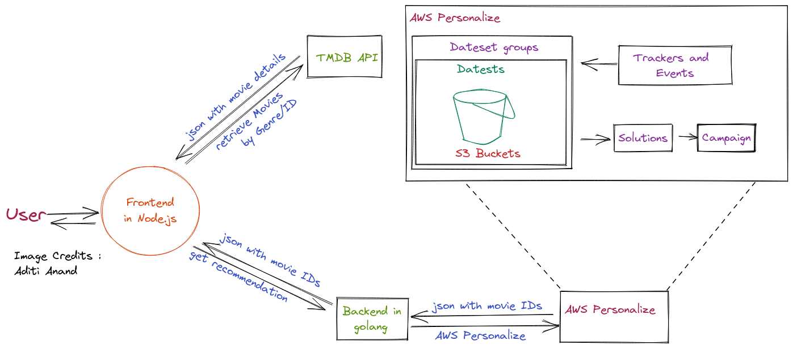

ℹ️ Due to billing issues, the website is currently hosted on AWS free tier EC2 istance, and is live at : [http://3.110.249.152:3000](http://3.110.249.152:3000)

# Architecture



# Code Structure

```console
.
|-- backend 
|   |-- controllers
|   |-- logger
|   |-- routes
|   `-- main.go
|
`-- frontend
    |
    `-- public  (website data)
    |   |-- css
    |   |-- img
    |   `-- js
    `-- server.js 

```

# AWS Personalize Jupyter Notebook

The python notebook file used for creating datasets, AWS resoruces and tokens. \
Available as [eengage-nb.ipynb](./engage-nb.ipynb)

# Benchmark

The benchmark have been done using Apache Benchmark Tool: [https://httpd.apache.org/docs/2.4/programs/ab.html](https://httpd.apache.org/docs/2.4/programs/ab.html)

Frontend server bechmark on localhost (no network overhead): 
```console
lagnos@rog:~/workspace/playground/$ ab -c 1000 -t 10 "http://localhost:3000/"
This is ApacheBench, Version 2.3 <$Revision: 1879490 $>
Copyright 1996 Adam Twiss, Zeus Technology Ltd, http://www.zeustech.net/
Licensed to The Apache Software Foundation, http://www.apache.org/

Benchmarking localhost (be patient)
Completed 5000 requests
Completed 10000 requests
Completed 15000 requests
Completed 20000 requests
Completed 25000 requests
Completed 30000 requests
Completed 35000 requests
Completed 40000 requests
Completed 45000 requests
Finished 47321 requests


Server Software:        
Server Hostname:        localhost
Server Port:            3000

Document Path:          /
Document Length:        932 bytes

Concurrency Level:      1000
Time taken for tests:   10.011 seconds
Complete requests:      47321
Failed requests:        0
Total transferred:      57871920 bytes
HTML transferred:       44210352 bytes
Requests per second:    4726.93 [#/sec] (mean)
Time per request:       211.554 [ms] (mean)
Time per request:       0.212 [ms] (mean, across all concurrent requests)
Transfer rate:          5645.39 [Kbytes/sec] received

Connection Times (ms)
              min  mean[+/-sd] median   max
Connect:        0   16 108.9      4    1021
Processing:    52  194  29.1    198     322
Waiting:        1  132  23.6    133     288
Total:         52  210 113.7    202    1230

Percentage of the requests served within a certain time (ms)
  50%    202
  66%    209
  75%    213
  80%    215
  90%    220
  95%    226
  98%    286
  99%   1204
 100%   1230 (longest request)
```


Backend server bechmark on localhost (no network overhead): 
```console
lagnos@rog:~/workspace/playground$ ab -c 1000 -t 10 "http://localhost:8080/api/"
This is ApacheBench, Version 2.3 <$Revision: 1879490 $>
Copyright 1996 Adam Twiss, Zeus Technology Ltd, http://www.zeustech.net/
Licensed to The Apache Software Foundation, http://www.apache.org/

Benchmarking localhost (be patient)
Completed 5000 requests
Completed 10000 requests
Completed 15000 requests
Completed 20000 requests
Completed 25000 requests
Completed 30000 requests
Completed 35000 requests
Completed 40000 requests
Completed 45000 requests
Completed 50000 requests
Finished 50000 requests


Server Software:        
Server Hostname:        localhost
Server Port:            8080

Document Path:          /api/
Document Length:        20 bytes

Concurrency Level:      1000
Time taken for tests:   3.810 seconds
Complete requests:      50000
Failed requests:        0
Total transferred:      6850000 bytes
HTML transferred:       1000000 bytes
Requests per second:    13122.71 [#/sec] (mean)
Time per request:       76.204 [ms] (mean)
Time per request:       0.076 [ms] (mean, across all concurrent requests)
Transfer rate:          1755.68 [Kbytes/sec] received

Connection Times (ms)
              min  mean[+/-sd] median   max
Connect:        0   37 105.4     26    1055
Processing:     1   36  28.9     32     276
Waiting:        0   26  28.7     21     251
Total:          1   73 110.6     58    1280

Percentage of the requests served within a certain time (ms)
  50%     58
  66%     65
  75%     68
  80%     70
  90%     78
  95%     89
  98%    242
  99%   1042
 100%   1280 (longest request)
